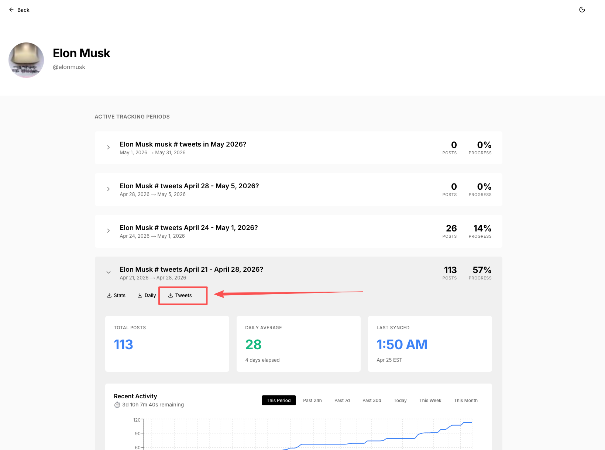
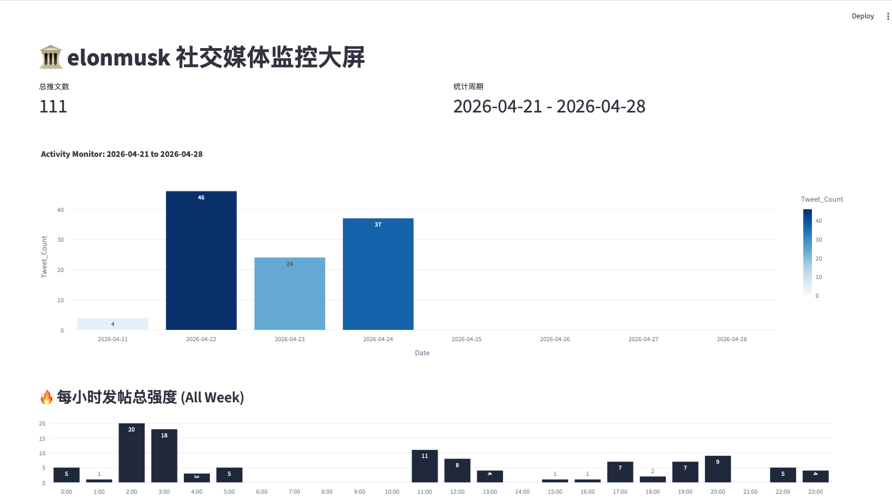
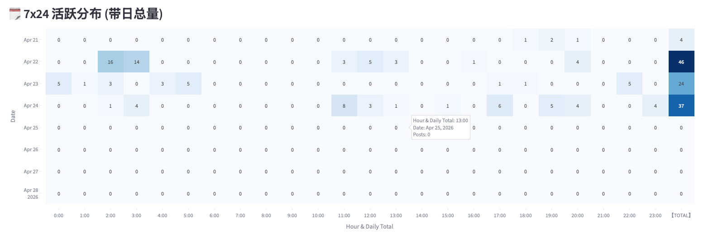

# tweetCountAnalysis
 用于分析推特发帖数量

官方数据源
[//]: # (https://xtracker.polymarket.com)
下载导入即可

三方分析网站：
[//]: # (https://elon-tracker.com/analytics)

运行命令：
必须项目路径下黑窗口执行
streamlit run app.py

替换自己的文件即可：
示例：
file_name = "elonmusk-Elon_Musk___tweets_April_21___April_28__2026_-tweets.csv"

